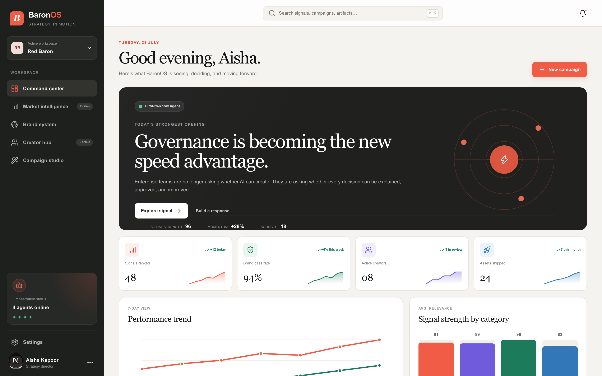
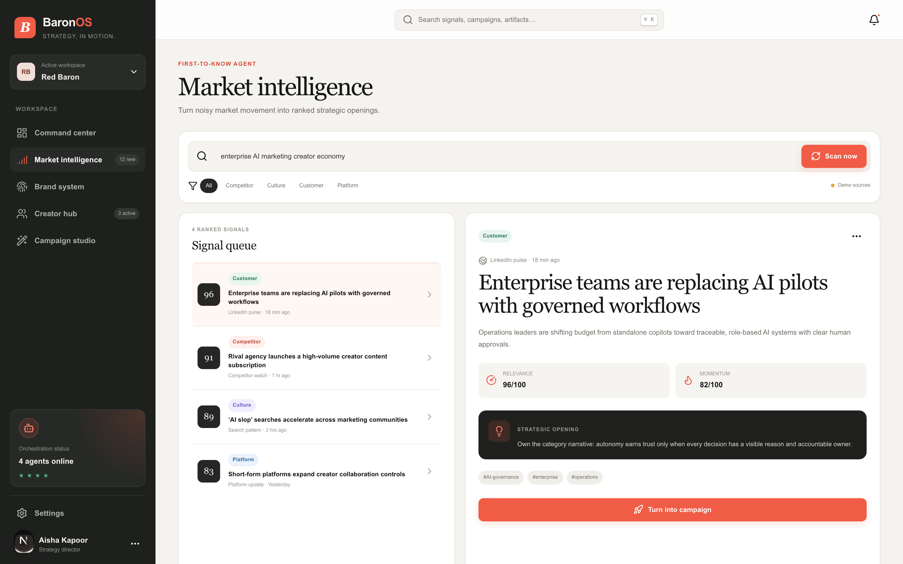
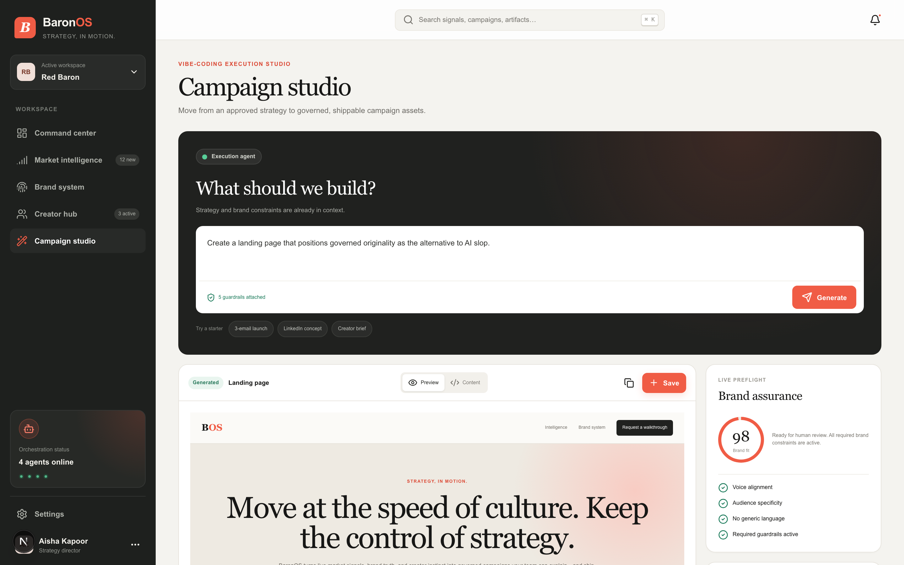
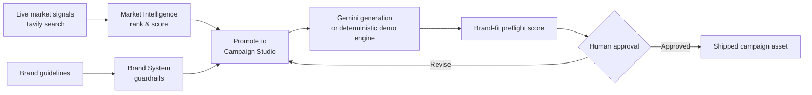

<div align="center">

# BaronOS

### The governed AI operating system for brand-safe campaign velocity

Turn live market signals into shippable, on-brand campaigns — without trading away control.

[](https://nextjs.org)
[](https://react.dev)
[](https://www.typescriptlang.org)
[](https://tailwindcss.com)
[]()
[]()



</div>

## The business problem

AI made content production cheap. It did not make **differentiation** cheap. Enterprise marketing teams are now stuck between two bad options:

- **Move fast with generic AI output** and quietly erode the brand, or
- **Move slow with manual review** and lose the market-timing advantage entirely.

BaronOS is built on a different bet: **governance is the speed advantage.** When brand rules are operational — not a PDF nobody reads — teams can approve faster because they trust the system that produced the work.

## What it does, and why it matters commercially

| Module | What it does | Business outcome |
|---|---|---|
| 🛰️ **Command Center** | Single dashboard for ranked opportunities, campaign pipeline, and 7-day performance trends | Faster leadership decisions — no digging across five disconnected tools |
| 📡 **Market Intelligence** | Ranks live signals (competitor, culture, customer, platform) by relevance and momentum | Get to a differentiated point of view before the market conversation is saturated |
| 🛡️ **Brand System** | Converts brand guidelines into active, testable guardrails with a live content preflight score | Cuts brand-review cycle time; reduces off-brand or non-compliant publishing risk |
| 🤝 **Creator Hub** | Generates creator-native briefs with explicit creative freedom *and* explicit non-negotiables | Preserves creator authenticity while protecting legal/compliance requirements |
| 🪄 **Campaign Studio** | Generates landing pages, emails, and social concepts, each scored against brand guardrails before human review | Shrinks time-to-first-draft without skipping approval accountability |

Every generated asset carries a **brand-fit score** and an explicit human-approval step — the system is built so decisions stay explainable, not just fast.

## See it in action

<table>
<tr>
<td width="50%" valign="top">

<p align="center"><sub><b>Market Intelligence</b> — ranked signals with a promoted strategic opening</sub></p>
</td>
<td width="50%" valign="top">

<p align="center"><sub><b>Campaign Studio</b> — generated asset with live brand-fit preflight</sub></p>
</td>
</tr>
</table>

## How it works



Both external calls are optional. Without `GEMINI_API_KEY` or `TAVILY_API_KEY`, every workflow still runs end-to-end on a deterministic demo engine — nothing in the product is gated behind a paid key.

## Tech stack

| Layer | Choice |
|---|---|
| Framework | [Next.js 16](https://nextjs.org) (App Router, Turbopack) |
| UI | [React 19](https://react.dev) + [Tailwind CSS 4](https://tailwindcss.com) |
| Language | TypeScript |
| Icons | [lucide-react](https://lucide.dev) |
| Charts | Hand-rolled SVG (sparklines, trend lines, bar charts) — zero chart dependencies |
| Generation (optional) | Google Gemini 2.5 Flash |
| Live search (optional) | Tavily Search API |
| Persistence (demo) | Browser `localStorage` — see [SPEC.md](./SPEC.md) for the Supabase production path |

## Quick start

Requirements: Node.js 22.13+.

```bash
npm install
cp .env.example .env.local
npm run dev
```

Open [http://localhost:3000](http://localhost:3000). **No environment variables are required** — the app is fully usable in deterministic demo mode out of the box.

## Optional live integrations

Add server-side keys to `.env.local` to swap the demo engine for live providers:

```bash
GEMINI_API_KEY=...
TAVILY_API_KEY=...
```

| Variable | Powers | Without it |
|---|---|---|
| `GEMINI_API_KEY` | Campaign Studio's live copy generation (landing pages, emails, social concepts) via Gemini 2.5 Flash | Falls back to a deterministic on-brand demo generator — the UI and scoring still work |
| `TAVILY_API_KEY` | Market Intelligence's live web/news search for real signals | Falls back to four seeded demo signals |

**Getting a Gemini key** (free tier available): go to [Google AI Studio](https://aistudio.google.com/apikey), sign in with a Google account, and click *Create API key*. No Google Cloud project setup is required for the free tier.

**Getting a Tavily key** (free tier available): create an account at [tavily.com](https://tavily.com), then copy the key from your dashboard's *API Keys* page.

Never commit `.env.local`.

## Validate

```bash
npm run lint
npm run build
```

Health endpoint (reports which mode the deployment is running in):

```text
GET /api/health
```

## Documentation

- [Product requirements](./PRD.md)
- [Engineering specification](./SPEC.md)
- [Original initiative](./baronOS.md)

## Production note

The included build uses browser storage for a zero-config functional prototype. [SPEC.md](./SPEC.md) defines the Supabase schema, authentication, row-level security, audit, ingestion, and production-hardening path. Do not put confidential client data into demo mode.

## License

Private prototype for Red Baron. Add an explicit repository license only after ownership and distribution terms are confirmed.
